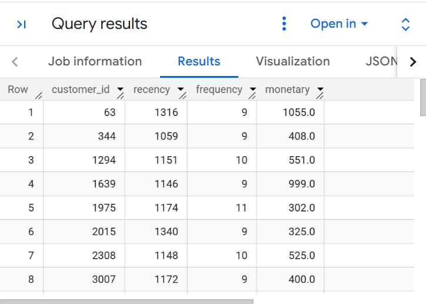
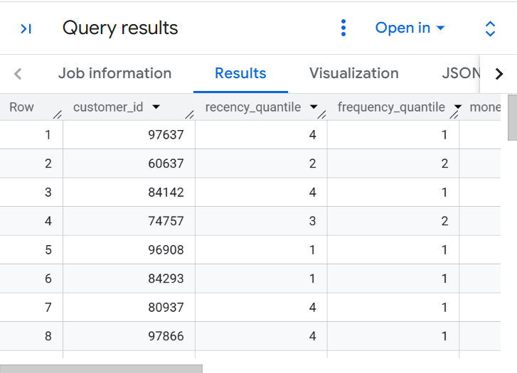
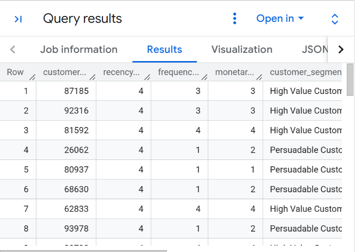

# Customer RFM Segmentation Pipeline
  

### The Business Case
Customer success teams lacked visibility into user retention risks. To solve this, I engineered an automated RFM (Recency, Frequency, Monetary) segmentation model in BigQuery to categorize users into actionable cohorts.

### The Pipeline Logic

**Step 1: Base Aggregation**
The initial SQL layer extracts raw user metrics. It calculates the exact days since last activity, the total transaction count, and the total lifetime value per user.

**Step 2: Statistical Distribution**
Absolute numbers lack context. The pipeline applies the `NTILE(4)` window function to distribute the raw user data into statistical quartiles. A score of 4 means the user ranks in the top 25% for that specific behavior.

**Step 3: Business Categorization**
The final logic engine utilizes SQL `CASE` statements to translate numerical quartiles into plain English business segments.

### The Code Repository
[View the full SQL pipeline here](sql/rfm_segmentation_pipeline.sql)

### Operational Impact
* **At-Risk Customers** automatically trigger a review by the Customer Success team, enabling proactive churn mitigation.
* **High Value Customers** are excluded from unnecessary promotional discounts to protect revenue margins.
* **Read more** via *https://highfalutin-hardcover-30d.notion.site/Operationalizing-Retention-RFM-Segmentation-via-BigQuery-3d6f3e7ab121802d83bff16d3d025ff2?source=copy_link*
